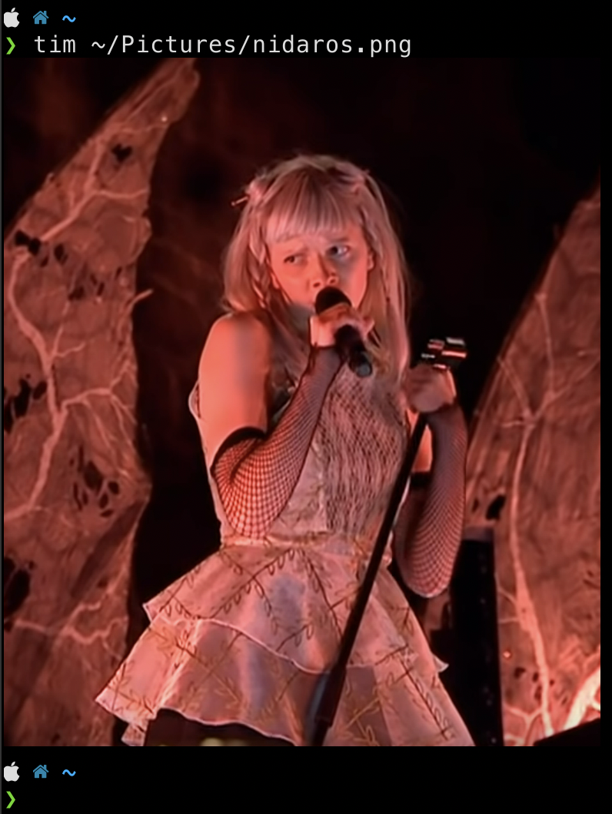

|discord|_
|test|_
|stars|_

About
=====

Terminal images in the `Mys programming language`_.

Project: https://github.com/mys-lang/package-tim

Installation
============

.. code-block:: myscon

   ❯ mys install tim

Usage
=====

API
===

tim.terminal
------------

.. mysfile:: src/terminal.mys

tim.kitty
---------

.. mysfile:: src/kitty.mys

tim.iterm
---------

.. mysfile:: src/iterm.mys

.. |discord| image:: https://img.shields.io/discord/777073391320170507?label=Discord&logo=discord&logoColor=white
.. _discord: https://discord.gg/GFDN7JvWKS

.. |test| image:: https://github.com/mys-lang/package-tim/actions/workflows/pythonpackage.yml/badge.svg
.. _test: https://github.com/mys-lang/package-tim/actions/workflows/pythonpackage.yml

.. |stars| image:: https://img.shields.io/github/stars/mys-lang/package-tim?style=social
.. _stars: https://github.com/mys-lang/package-tim

.. _Mys programming language: https://mys-lang.org
